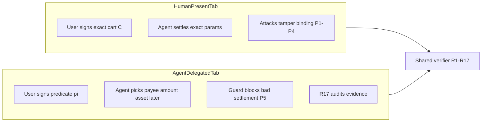

# Attack Simulator — Visitor UX + Research Presentation Plan

## Problem (validated against repo)

Phase 4 backend is complete ([`packages/attack-core/src/mode-b.ts`](packages/attack-core/src/mode-b.ts), [`services/attack-simulator/src/server.ts`](services/attack-simulator/src/server.ts), [`experiments/benchmarks/p5-attack-matrix.md`](experiments/benchmarks/p5-attack-matrix.md)). The UI gap is real:

| Dimension      | Mode A ([`attack-runner.tsx`](<apps/web-demo/src/app/(demo)/attacks/attack-runner.tsx>)) | Mode B ([`predicate-attack-runner.tsx`](<apps/web-demo/src/app/(demo)/attacks/predicate-attack-runner.tsx>)) |
| -------------- | ---------------------------------------------------------------------------------------- | ------------------------------------------------------------------------------------------------------------ |
| Tab label      | "Binding attacks (Mode A)" — internal jargon                                             | "Predicate attacks (Mode B)" — internal jargon                                                               |
| Fixture picker | Card grid + human labels (`attackLabel()`)                                               | Raw `PREDICATE_AMOUNT_VIOLATION` buttons                                                                     |
| Story          | `AttackAnatomyPanel`: summary, steps, mutations, honest vs attacked diff                 | Status badge + failed rules + raw JSON                                                                       |
| Context        | Scenario + prevention layer explained inline                                             | One-line CardDescription only                                                                                |
| Matrix         | Live row highlight, `BASELINE_LABELS` from attack-core                                   | Duplicated labels; monospace attack IDs                                                                      |
| API richness   | `AttackRunResult.anatomy` populated in attack-core                                       | `PredicateAttackRunResult` has **no anatomy field**                                                          |

A general visitor cannot answer: _"What did the human sign?", "What did the agent try?", "Why is this different from checkout?"_



---

## Design principles

1. **Visitor-first labels, research-second IDs** — primary UI uses commerce language from [CONTEXT §7](CONTEXT_FULL_PROJECT.md); `Mode A` / `R17` / fixture IDs appear only in research mode or subtle subtitles.
2. **Parity without duplication** — extract shared attack-simulator primitives; Mode B gets the same interaction pattern as Mode A, not a second bespoke layout.
3. **Predicate story is the novel research contribution** — UI must teach P5 (π signed once → agent settles later → guard + R17) explicitly; this is what the paper cites separately from the Phase 3 matrix.
4. **Minimal scope** — attack simulator + shared copy constants only; full Mode B walkthrough on `/mandate`/`/payment` remains Phase 5.

---

## 1. Shared copy layer (single source of truth)

Add [`apps/web-demo/src/lib/demo-copy.ts`](apps/web-demo/src/lib/demo-copy.ts):

```ts
export const FLOW_LABELS = {
  modeA: {
    short: "Human-present checkout",
    tab: "You approve each payment",
    research: "Mode A · exact binding · P1–P4",
  },
  modeB: {
    short: "Agent-delegated spending",
    tab: "You set limits, agent pays",
    research: "Mode B · predicate mandate · P5",
  },
} as const;
```

**Tab rename** in [`attacks-tabs.tsx`](<apps/web-demo/src/app/(demo)/attacks/attacks-tabs.tsx>):

| Current                    | Proposed (default)             | Research subtitle (when research mode on) |
| -------------------------- | ------------------------------ | ----------------------------------------- |
| Binding attacks (Mode A)   | **You approve each payment**   | Cross-layer binding · Mode A · P1–P4      |
| Predicate attacks (Mode B) | **You set limits, agent pays** | Predicate soundness · Mode B · P5         |

Update [`demo-nav.ts`](apps/web-demo/src/lib/demo-nav.ts) attacks `pageDescription` to mention both flows (not "Phase 3" only).

Optional small follow-up (same PR if cheap): align [`mode-switch.tsx`](apps/web-demo/src/components/mode-switch.tsx) to `Human-present checkout` / `Agent-delegated spending` with research subtitles — keeps terminology consistent site-wide.

Record visitor-facing naming in [`DECISIONS.md`](DECISIONS.md) under a new "Demo copy" row mapping internal ↔ public labels.

---

## 2. Backend — predicate attack anatomy (attack-core)

Extend [`packages/attack-core/src/mode-b.ts`](packages/attack-core/src/mode-b.ts) and [`types.ts`](packages/attack-core/src/types.ts):

**New types**

```ts
type PredicateTraceSummary = {
  mandateType: "INTENT";
  predicate: SpendingPredicate; // what human signed (π)
  concreteSettlement: { payTo; value; asset; chainId; validBefore };
  commitmentCprime: Hex;
  nonce: Hex;
  guardWouldAllow: boolean;
};

type PredicateAttackAnatomy = {
  summary: string; // plain English, 1–2 sentences
  steps: string[]; // 3–4 step narrative
  mutations: AttackMutation[]; // π constraint vs agent attempt
  evidenceFocus: string[]; // AP2_INTENT_MANDATE, X402_*, guard
  detectedBy: string[]; // predicate-guard, R17, R11–R13
  authorizedTrace: PredicateTraceSummary; // honest within-π settlement
  violatedTrace: PredicateTraceSummary; // fixture's tampered attempt
};
```

**Per-fixture anatomy templates** on `MODE_B_PREDICATE_FIXTURES` (mirror Mode A pattern in [`index.ts`](packages/attack-core/src/index.ts)):

| Fixture          | Visitor summary (example)                 | Key mutation row                                        |
| ---------------- | ----------------------------------------- | ------------------------------------------------------- |
| Happy path       | Agent stays within signed spending limits | (none — show π vs matching settlement)                  |
| Payee violation  | Agent tries to pay an unapproved merchant | `concreteSettlement.payTo` vs `predicate.allowedPayees` |
| Amount violation | Agent tries to spend above your cap       | `value` 2.00 → 9.99 vs `maxValue` 5.00                  |
| Asset violation  | Agent tries wrong token                   | `asset` USDC → WETH                                     |
| Expired          | Agent settles after your deadline         | `settledAt` vs `predicate.validUntil`                   |

**Implementation approach:** in `runPredicateAttack`, also build an honest `buildValidModeBBundle()` baseline (same predicate, default concrete) to populate `authorizedTrace`; use the fixture bundle for `violatedTrace`. Run guard evaluation on both for `guardWouldAllow`.

Add `anatomy` + optional `scenario` (predicateId, maxValue, merchant, attacker payee) to `PredicateAttackRunResult`.

**Tests:** extend [`packages/attack-core/test/mode-b.test.ts`](packages/attack-core/test/mode-b.test.ts) — anatomy non-empty, mutations match fixture, happy path has zero mutations but valid diff panel.

Export `PREDICATE_ATTACK_LABELS` (visitor title per fixture id) from attack-core so UI and [`p5-attack-matrix.md`](experiments/benchmarks/p5-attack-matrix.md) generation share labels.

---

## 3. Frontend — Mode B UX parity

Refactor [`apps/web-demo/src/app/(demo)/attacks/`](<apps/web-demo/src/app/(demo)/attacks/>) into shared + mode-specific pieces:

```
attacks/
  attacks-tabs.tsx          # tabs + page intro
  attack-runner.tsx         # Mode A (thin wrapper)
  predicate-attack-runner.tsx
  components/
    attack-page-intro.tsx   # scenario comparison hero
    attack-fixture-grid.tsx
    attack-result-summary.tsx
    attack-anatomy-panel.tsx      # Mode A (move existing)
    predicate-anatomy-panel.tsx   # π vs settlement focus
    baseline-matrix-section.tsx   # shared B0–B3 table
    prevention-layer-badge.tsx    # maps x402 | predicate-guard | verifier
```

### 3a. Page intro (both tabs)

New **`AttackPageIntro`** at top of [`attacks-tabs.tsx`](<apps/web-demo/src/app/(demo)/attacks/attacks-tabs.tsx>) — always visible:

- Two-column "Which shopping scenario?" card:
  - **Left:** Human at checkout — signs exact amount, merchant, asset (C + H(C))
  - **Right:** Not at checkout — signs spending rules π; agent chooses details later (C' + guard)
- One sentence on **what attacks prove**: P1–P4 binding vs **P5 predicate soundness** (links to paper property names in research mode only)
- Compact mermaid or static step strip (reuse pattern from Phase 4 plan flowchart)

### 3b. Predicate runner parity

Rebuild [`predicate-attack-runner.tsx`](<apps/web-demo/src/app/(demo)/attacks/predicate-attack-runner.tsx>) to match Mode A structure:

1. **Fixture grid** — cards with visitor titles ("Spend over your limit", "Pay wrong merchant") not SCREAMING_SNAKE; fixture id in research mode only
2. **Selected fixture detail** — ShieldAlert card + plain description + expected outcome badges
3. **Run + scroll to anatomy** — same `#attack-anatomy` behavior as Mode A
4. **`PredicateAnatomyPanel`** — dedicated layout emphasizing:
   - **What you signed (π)** — allowed payees, max value, assets, deadline
   - **What the agent tried** — concrete settlement fields
   - **What changed** — mutation table (reuse Mode A table styling)
   - **How it was stopped** — guard blocked at settlement vs R17 post-audit (prevention layer badge with plain copy: "Blocked before payment" / "Caught in audit")
   - **Honest vs violated trace diff** — predicate-relevant paths highlighted (amber rows like Mode A)
5. **P5 baseline matrix** — human row labels via `PREDICATE_ATTACK_LABELS`; tooltip or subtitle with B0–B3 definitions from [`BASELINE_DESCRIPTIONS`](packages/attack-core/src/baselines.ts)
6. **Metrics row** — verify latency, event count, storage (currently missing on Mode B)
7. **Protocol detail** — `ProtocolPanel` behind research mode gate (Mode A always shows it; Mode B should match — gate both for consistency)

### 3c. Prevention layer visitor copy

| Internal          | Visitor badge                     |
| ----------------- | --------------------------------- |
| `x402`            | Blocked at payment (nonce replay) |
| `predicate-guard` | Blocked before settlement         |
| `verifier`        | Caught in evidence audit          |
| `none`            | Allowed (baseline gap)            |

### 3d. Extract shared pieces from Mode A

Move `attackLabel`, `outcomeBadge`, `BaselineMatrixSection` out of [`attack-runner.tsx`](<apps/web-demo/src/app/(demo)/attacks/attack-runner.tsx>) so both runners stay in sync. Import `BASELINE_LABELS` from `@clb-acel/attack-core` in predicate runner (remove local duplicate).

---

## 4. Research contribution layer (paper-ready UI)

These elements make the demo cite-able without reading JSON:

1. **Property badges** — P1–P4 on tab 1, **P5 Predicate soundness** on tab 2 (matches [CONTEXT §6](CONTEXT_FULL_PROJECT.md))
2. **Baseline explainer accordion** above each matrix — B0–B3 one-liners from `BASELINE_DESCRIPTIONS`; Mode B adds guard-specific B3 note from [`p5-attack-matrix.md`](experiments/benchmarks/p5-attack-matrix.md)
3. **Matrix row = paper row** — regenerate [`p5-attack-matrix.md`](experiments/benchmarks/p5-attack-matrix.md) via `e2e:phase4b` using same visitor labels as UI (optional column "Public name")
4. **Research mode toggle** — when on: fixture IDs, `Mode A`/`Mode B`, R17, C', full `PredicateAttackRunResult` JSON
5. **"Why separate matrices?" callout** — 1 paragraph explaining Option A decision ([DECISIONS.md Phase 4 follow-up](DECISIONS.md)): Mode B tests π enforcement, not a redundant 10×4 re-run

No new benchmark logic — presentation only.

---

## 5. Production checklist

- **Progressive disclosure:** story → run → outcome → anatomy → matrix → (research) protocol JSON
- **Accessibility:** fixture cards are `<button>` with aria-pressed; badges have text not color-only meaning
- **Loading / offline:** preserve fallback fixtures; matrix null state explains `attack-simulator :4006` + `bun run e2e:phase4b`
- **Responsive:** reuse `@container` patterns from Mode A card grid
- **Consistency:** one prevention badge component, one matrix component, one copy module
- **No scope creep:** do not wire Mode B into `/mandate`/`/payment` in this workstream

---

## 6. Verification

| Check                        | Command / action                                                                              |
| ---------------------------- | --------------------------------------------------------------------------------------------- |
| attack-core anatomy tests    | `bun test packages/attack-core/test/mode-b.test.ts`                                           |
| P5 benchmark unchanged logic | `bun run e2e:phase4b`                                                                         |
| UI smoke                     | Open `/attacks` → both tabs → run amount violation → anatomy shows π max 5.00 vs 9.99 attempt |
| Research mode                | Toggle on → fixture IDs + R17 + JSON visible                                                  |
| Visitor test                 | Tab titles contain no "Mode A/B" unless research mode on                                      |

---

## Suggested PR sequence

1. **PR-A:** `demo-copy.ts` + tab renames + page intro + DECISIONS row
2. **PR-B:** attack-core `PredicateAttackAnatomy` + API extension + tests
3. **PR-C:** shared attack UI components + predicate runner parity + Mode A extraction
4. **PR-D:** p5 matrix label sync + optional mode-switch copy alignment

Can ship as one PR if preferred; backend anatomy (PR-B) should land before UI (PR-C).

---

## Explicitly out of scope

- Phase 5 live delegated walkthrough (wallet signs INTENT over HTTP)
- Re-running 10 Mode A attacks under Mode B
- Tamarin / formal P5 model
- Full demo-shell "Mode A Foundation" rebrand (separate polish pass)
