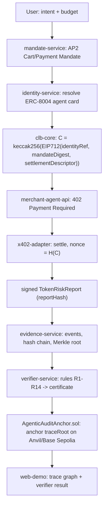

## CLB-ACEL Mode A Foundation

Scope: Phase 0 (scaffold) + Phase 1 (evidence graph) + Phase 2 (Mode A CLB exact flow). Stops before attack simulator (Phase 3), Mode B, and AWS hardening. Adopts all section-25 defaults: token-risk report use case, Base Sepolia, bun + TypeScript, mock ERC-8004 / local AP2 adapter, browser wallet (user) + service keys (agents), deterministic heuristic risk scoring.

**Repo state (updated):** Phases 0–2 **complete** (Mode A foundation). Full adapter stack, six Fastify services with Swagger, verifier (R1–R14), in-process orchestrator, Foundry contract sources, uv Python scorer, and web demo screens 1–6 + 8 wired to a deterministic Mode A trace. **55 tests** pass. Next milestone: **Phase 3** (attack simulator + benchmarks). See `DECISIONS.md` for Phase 2 follow-ups (on-chain anchor wiring, Base Sepolia, browser wallet, LLM explanation).

### Target end-to-end flow (Mode A)

### Key design decisions

- All protocol integrations sit behind adapters (`packages/ap2-adapter`, `packages/x402-adapter`, `packages/erc8004-adapter`) so official SDKs can be swapped later, per section 2 and section 26 ("do not hardcode protocol objects").
- The verifier is deterministic TypeScript only; LLMs never verify (section 5, 9).
- Commitment uses keccak256 over canonical EIP-712 typed data with explicit `chainId`/domain separation to block transplant/replay (section 3.1, 7, 20).
- Chain stores only roots/hashes; full evidence stays in Postgres/MinIO (section 8.4, 12).
- Record every choice in `DECISIONS.md`.
- Frontend uses **latest Next.js** (App Router) with **shadcn/ui** for all demo UI components.
- Python libraries use **uv** for dependency management (`pyproject.toml` + `uv.lock`).
- All backend APIs expose **OpenAPI/Swagger** docs for research/debugging.

### Phase 0 - Scaffold (PR1-PR2) ✅ COMPLETE

**Delivered:**

| Item                 | Location                                         | Notes                                                        |
| -------------------- | ------------------------------------------------ | ------------------------------------------------------------ |
| Bun workspace        | `package.json`, `bun-workspace.yaml`, `bun.lock` | Workspaces: `apps/*`, `packages/*`, `services/*`             |
| TypeScript base      | `tsconfig.base.json`, `tsconfig.json`            | Project references for schemas + web-demo                    |
| Lint / format        | `eslint.config.js`, `prettier.config.js`         | ESLint 9 flat config + Prettier                              |
| Infrastructure       | `docker-compose.yml`                             | PostgreSQL 16, MinIO (+ bucket init), Anvil (chain-id 31337) |
| Environment template | `.env.example`                                   | Matches section 22 exactly                                   |
| Architecture log     | `DECISIONS.md`, `README.md`, `.gitignore`        | Phase 0 decisions recorded                                   |
| Shared schemas       | `packages/schemas` (`@clb-acel/schemas`)         | Zod schemas + inferred types (see below)                     |
| Web demo shell       | `apps/web-demo` (`@clb-acel/web-demo`)           | Next.js 16.2.6 App Router, Tailwind v4, shadcn/ui            |

**Toolchain (actual):**

- `create-next-app@latest` for Next.js scaffold (not hand-written)
- `bun install` at repo root for workspace deps
- `bunx shadcn init --defaults` + `bunx shadcn add card tabs badge table dialog switch separator input label textarea` for UI components (not hand-written)

**`packages/schemas` exports:**

- `IdentityRef`, `AgentCard`, `Mandate`, `SettlementDescriptorExact`, `PredicateDescriptor`, `SpendingPredicate`
- `CLBCommitmentInput`, `EvidenceEvent`, `EvidenceNode`, `EvidenceEdge`, `EvidenceGraph`
- `VerificationResult`, `VerificationCertificate`, `TokenRiskReport`
- Shared helpers: `HexStringSchema`, `AddressSchema`

**`apps/web-demo` screens (stubbed, section 18):**

| #   | Route        | Screen                                 |
| --- | ------------ | -------------------------------------- |
| 1   | `/intent`    | Create Intent                          |
| 2   | `/discovery` | Agent Discovery                        |
| 3   | `/mandate`   | Mandate Signing                        |
| 4   | `/payment`   | x402 Payment Flow                      |
| 5   | `/evidence`  | Evidence Graph                         |
| 6   | `/verifier`  | Verifier Result                        |
| 7   | `/attacks`   | Attack Simulator (Phase 3 placeholder) |
| 8   | `/anchor`    | Audit Anchor                           |

Shared `(demo)` layout: sidebar nav (`demo-nav.ts`), `DemoShell` component, **research mode** toggle (`ResearchModeProvider` + shadcn Switch) exposing stub protocol JSON via `ProtocolPanel`. Root `/` redirects to `/intent`.

**Phase 0 verification:**

- `bun install` — workspace deps resolve (432 packages)
- `bun run build` in `apps/web-demo` — production build passes (12 static routes)

### Phase 1 - Evidence graph without payments (PR5, PR7) ✅ COMPLETE

- `packages/evidence-core`: canonical JSON, event hash, hash-chain, Merkle root.
- `services/evidence-service`: Fastify endpoints + Postgres storage + Swagger.
- Web demo evidence graph (now also fed by Mode A in-process trace on `/evidence`).

### Phase 2 - Mode A CLB exact flow (PR3–PR10) ✅ COMPLETE (foundation)

| Item         | Location                                                                     | Notes                                                                  |
| ------------ | ---------------------------------------------------------------------------- | ---------------------------------------------------------------------- |
| CLB core     | `packages/clb-core`                                                          | EIP-712 C, nonce = H(C), mandate digest                                |
| Adapters     | `ap2-`, `x402-`, `erc8004-`, `delivery-core`, `verifier-core`, `service-kit` | Swappable interfaces                                                   |
| Identity     | `services/identity-service` (4002)                                           | In-memory ERC-8004 mock + agent-card                                   |
| Mandates     | `services/mandate-service` (4003)                                            | INTENT/CART/PAYMENT signed over C                                      |
| Merchant     | `apps/merchant-agent-api` (4004)                                             | x402 402/settle, signed TokenRiskReport                                |
| Orchestrator | `apps/agent-orchestrator` (4000)                                             | In-process Mode A flow + HTTP API                                      |
| Verifier     | `services/verifier-service` (4005)                                           | R1–R14 deterministic rules                                             |
| Contracts    | `contracts/`                                                                 | AgenticAuditAnchor + MockERC8004IdentityRegistry + `.t.sol`            |
| Python       | `experiments/risk-scoring/`                                                  | uv package, byte-parity with TS scorer                                 |
| Swagger      | All 6 Fastify services                                                       | `/docs` per service; see `docs/api-reference.md`                       |
| Web demo     | Screens 1–6, 8                                                               | Live in-process trace via `getModeATrace()`; `/attacks` stub (Phase 3) |
| Tests        | 55 across 12 files                                                           | `bun test`; `bun run build` passes full workspace                      |

**Phase 2 foundation deferrals** (documented in `DECISIONS.md`; not blockers for Phase 3):

- On-chain anchor not wired (`evidence-service` `/anchor` → `PENDING_CONTRACT`; run `forge test` + deploy locally).
- Orchestrator in-process only (no cross-service HTTP E2E to live Postgres evidence store).
- Local x402 facilitator + Anvil test keys (not Base Sepolia / browser wallet).
- Heuristic scoring only (LLM explanation adapter deferred).
- Python scorer for evaluation only (not subprocess-wired into merchant API).

### Verification for this milestone (subset of section 23)

- Unit: ✅ canonical JSON, EIP-712 C, mandate digest, nonce, Merkle, signatures.
- Integration: ✅ Mode A trace PASS (orchestrator + verifier-core); registry payment key; x402 settle + nonce reuse blocked. ⏳ anchor contract stores root (contract source only).
- E2E: ✅ intent → mandate → payment → report → verify → UI graph. ⏳ on-chain root anchor; ⏳ attack simulation (Phase 3).

### Explicitly out of scope (later milestones)

- Phase 3 attack simulator and baseline benchmarks (B0-B3), verifier rules tied to attacks beyond R1-R14.
- Phase 4 Mode B predicate flow + `PredicatePaymentGuard.sol`.
- Phase 5 AWS deployment, CI/CD, encrypted evidence payloads, formal (Tamarin) models.
