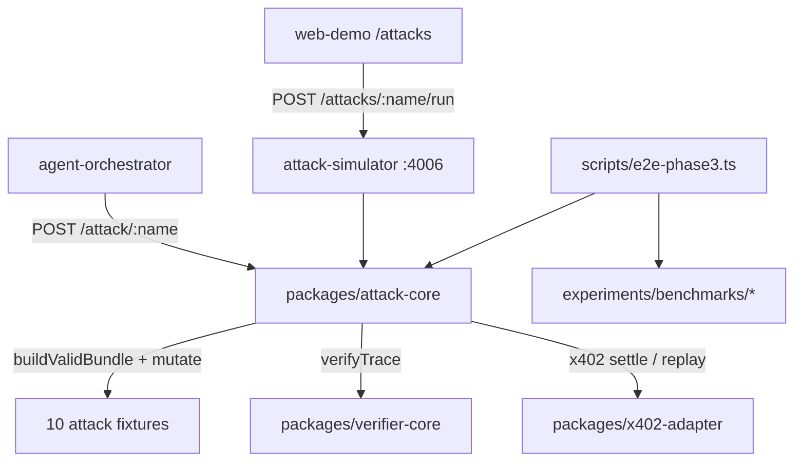

# Phase 3 — Attack Simulator

Scope: deliver all five Phase 3 items from [CONTEXT_FULL_PROJECT.md](CONTEXT_FULL_PROJECT.md) §21 — attack fixtures, baseline comparison (B0–B3), attack matrix, latency/gas/storage metrics, UI attack runner. Stops before Mode B (Phase 4) and the live interactive demo (Phase 5). Follows the same monorepo patterns as the [Phase 0–2 plan](/Users/md.alamin/.cursor/plans/clb-acel_mode_a_foundation_96d6e101.plan.md).

**Repo state:** Phases 0–2 complete. Verifier R1–R14 live in [`packages/verifier-core`](packages/verifier-core). Five attacks already covered in [`packages/verifier-core/test/verifier-core.test.ts`](packages/verifier-core/test/verifier-core.test.ts) via `buildValidBundle()` + mutation. [`apps/web-demo/src/app/(demo)/attacks/page.tsx`](<apps/web-demo/src/app/(demo)/attacks/page.tsx>) is a stub. No `services/attack-simulator/`, no `experiments/benchmarks/`, no `POST /attack/:attackName`.

### Target architecture



---

## Key design decisions (record in [DECISIONS.md](DECISIONS.md))

| Decision                   | Choice                                                                                                           | Rationale                                                                                                                               |
| -------------------------- | ---------------------------------------------------------------------------------------------------------------- | --------------------------------------------------------------------------------------------------------------------------------------- |
| Core logic location        | New `packages/attack-core`                                                                                       | Same pattern as `verifier-core` — pure TS, unit-testable, reused by service + orchestrator + CLI                                        |
| HTTP surface               | New `services/attack-simulator` on **port 4006** + orchestrator proxy `POST /attack/:attackName`                 | Matches §11 layout and §14.1 API spec                                                                                                   |
| Fixture strategy           | Refactor `buildValidBundle()` out of verifier tests into `attack-core`; attacks = `mutate(bundle)` functions     | Already proven in [`verifier-core.test.ts`](packages/verifier-core/test/verifier-core.test.ts); deterministic via pinned keys + `nowMs` |
| Baseline model             | **Logical B0–B3 matrix** validated against live B3 verifier runs                                                 | B0–B2 are simulated outcomes (what each weaker stack would detect/prevent); B3 runs real fixtures + `verifyTrace()`                     |
| Spec result codes vs rules | Map high-level codes (`PAYEE_MISMATCH`, etc.) to `failedRules[]` in fixture metadata                             | Verifier stays R1–R14; attack fixtures document the mapping per §10                                                                     |
| Decision-layer attacks     | `FAKE_FEEDBACK` + `PROMPT_INJECTION_SELECTION` use **audit-layer checks** in attack-core, not new verifier rules | §10 explicitly limits CLB to binding; honest scope per §28                                                                              |
| Merchant malicious mode    | Optional `X-Attack-Mode` header on merchant API for HTTP-path attacks only                                       | §16.2; fixture path covers most attacks without merchant changes                                                                        |
| Benchmark artifacts        | Commit a **checked-in baseline snapshot** under `experiments/benchmarks/`; CI regenerates and fails on drift     | Research reproducibility per §19.3                                                                                                      |

---

## 1. `packages/attack-core` — attack fixtures (PR11a)

**New package** `@clb-acel/attack-core` with:

### Types ([`packages/schemas`](packages/schemas/src/index.ts) extensions)

```ts
type AttackId = /* 10 enum values from §10 */;
type BaselineId = "B0" | "B1" | "B2" | "B3";
type AttackResultCode = /* PAYEE_MISMATCH, AMOUNT_EXCEEDS_MANDATE, ... */;

type AttackFixture = {
  id: AttackId;
  description: string;
  expectedResultCode: AttackResultCode;
  expectedFailedRules: RuleId[];       // primary rules; may be empty for audit-layer attacks
  mutate: (bundle: TraceBundle) => TraceBundle | Promise<TraceBundle>;
  baselineOutcomes: Record<BaselineId, { detected: boolean; prevented: boolean; note: string }>;
};

type AttackRunResult = {
  attackId: AttackId;
  traceId: string;
  verification: VerifyTraceOutput;
  expectedResultCode: AttackResultCode;
  matched: boolean;                  // failedRules intersect expectedFailedRules (or audit check passes)
  preventionLayer?: "x402" | "verifier" | "none";
  metrics: { verifyLatencyMs: number; eventCount: number; storageBytesEstimate: number };
};
```

### Ten fixtures (§10 table)

| Attack                       | Mutation                                                                 | Expected rule(s)                             | B3 behavior                          |
| ---------------------------- | ------------------------------------------------------------------------ | -------------------------------------------- | ------------------------------------ |
| `PAYEE_SUBSTITUTION`         | `descriptor.payTo = attacker`                                            | R12                                          | Detected                             |
| `AMOUNT_ESCALATION`          | `value: "3.00"`, `maxAmount: "2.00"`                                     | R11                                          | Detected                             |
| `ASSET_SWITCH`               | `asset: "WETH"`                                                          | R13                                          | Detected                             |
| `CHAIN_TRANSPLANT`           | `settlement.chainId = 1`                                                 | R10                                          | Detected                             |
| `AGENT_IDENTITY_SWAP`        | unauthorized payer key                                                   | R4                                           | Detected                             |
| `MANDATE_REPLAY`             | settle same nonce twice on shared facilitator                            | R9 + x402 `NonceAlreadyConsumedError` on 2nd | **Prevented** at x402                |
| `CART_OR_TASK_SWITCH`        | mandate `taskHash` ≠ report `inputDataHash`                              | R2 (report hash) or new R15                  | Detected                             |
| `PAYMENT_WITHOUT_DELIVERY`   | omit report or break `reportHash`                                        | R2 / R14                                     | Detected                             |
| `FAKE_FEEDBACK`              | append `ERC8004_FEEDBACK` event without prior `VERIFICATION_CERTIFICATE` | audit-layer check                            | Detected (B2+)                       |
| `PROMPT_INJECTION_SELECTION` | discovery event selects merchant outside `allowedPayees`                 | audit-layer constraint check                 | Detected if constraints logged (B2+) |

**Refactor:** move `buildValidBundle()` + test keys from [`verifier-core.test.ts`](packages/verifier-core/test/verifier-core.test.ts) into `attack-core/src/fixtures.ts`. Verifier tests import from attack-core (no duplication).

**Exports:** `ATTACK_FIXTURES`, `runAttack(id, options?)`, `runAllAttacks()`, `buildBaselineMatrix(results)`.

---

## 2. Verifier + x402 extensions (PR11b)

Minimal changes to support replay and task-binding attacks:

### R9 replay enhancement — [`packages/verifier-core/src/index.ts`](packages/verifier-core/src/index.ts)

Extend `TraceBundle` ([`types.ts`](packages/verifier-core/src/types.ts)) with optional:

```ts
nonceReplayAttempt?: boolean;  // true when a second settlement was attempted
```

When `nonceReplayAttempt === true`, R9 fails with detail `"Nonce replay detected"`. Keeps R9 deterministic without global facilitator state in the verifier.

### Task hash binding — new rule **R15_TASK_HASH_MATCHES** (or extend R14)

When `mandate.constraints.taskHash` is set, assert `report.inputDataHash === mandate.constraints.taskHash`. Covers `CART_OR_TASK_SWITCH` with one focused rule. Update `RULE_ORDER`, certificate `rulesChecked`, and existing PASS test (taskHash unset → rule passes vacuously).

### Audit-layer helpers — `attack-core/src/audit-checks.ts`

- `checkFakeFeedback(events)` — feedback node exists without verified trace predecessor
- `checkPromptInjection(events, mandate)` — selected merchant not in `allowedPayees` / intent constraints

These run inside `runAttack()` for the two decision-layer attacks; results feed the matrix without expanding verifier scope beyond R15.

---

## 3. Baseline comparison B0–B3 (PR11c)

Implement in `attack-core/src/baselines.ts`:

| Baseline | Stack simulated                                           | Typical outcome per attack                                                                       |
| -------- | --------------------------------------------------------- | ------------------------------------------------------------------------------------------------ |
| **B0**   | Vanilla x402 only — no mandate, no CLB, no verifier       | Payment completes; **not detected, not prevented**                                               |
| **B1**   | AP2 mandate + x402, **no** `nonce = H(C)` binding         | Payment may complete; post-hoc audit fails R8 if verifier run, but **not prevented in-protocol** |
| **B2**   | ACEL audit-only — evidence + verifier, no CLB enforcement | **Detected** post-settlement for binding attacks; **not prevented** at x402                      |
| **B3**   | Full CLB + ACEL (current system)                          | **Detected** via verifier; **prevented** where x402 nonce/facilitator blocks (replay)            |

`buildBaselineMatrix()` produces the §19 attack matrix: rows = attacks, columns = B0–B3, cells = `{ detected, prevented, failedRules?, notes }`. B3 cells are **live-validated** from `runAttack()` results; B0–B2 cells come from the documented logical model (cross-checked in unit tests).

---

## 4. `services/attack-simulator` — benchmark runner API (PR11d)

New Fastify service on port **4006**, using `@clb-acel/service-kit` (Swagger at `/docs`):

| Endpoint                      | Purpose                                                     |
| ----------------------------- | ----------------------------------------------------------- |
| `GET /health`                 | Health check                                                |
| `GET /attacks`                | List fixture metadata (id, description, expectedResultCode) |
| `POST /attacks/:attackId/run` | Run single attack → `AttackRunResult`                       |
| `POST /benchmark`             | Run all 10 attacks + build matrix + collect metrics         |
| `GET /benchmark/latest`       | Return last in-memory benchmark result                      |
| `GET /benchmark/matrix`       | Baseline matrix only (for UI table)                         |

Wire into [`scripts/start-all-services.sh`](scripts/start-all-services.sh) and [`.env.example`](.env.example):

```bash
ATTACK_SIMULATOR_URL=http://localhost:4006
```

---

## 5. Orchestrator attack endpoint (PR11e)

Add to [`apps/agent-orchestrator/src/server.ts`](apps/agent-orchestrator/src/server.ts):

```http
POST /attack/:attackName
```

Body: `{ transport?: "in-process" | "http", nowMs?: number }`. Delegates to `attack-core.runAttack()`. Returns `AttackRunResult` + optional trace summary. Document in [`docs/api-reference.md`](docs/api-reference.md).

---

## 6. Metrics + benchmark outputs (PR11f)

### Metrics collection in `attack-core/src/metrics.ts`

| Metric               | Source                                                                                                                     |
| -------------------- | -------------------------------------------------------------------------------------------------------------------------- |
| Verification latency | `performance.now()` around `verifyTrace()`                                                                                 |
| Settlement latency   | around x402 `settle()` in replay fixture                                                                                   |
| Storage per trace    | `JSON.stringify(events).length` + event count                                                                              |
| Anchor gas           | `forge test --gas-report` on [`AgenticAuditAnchor.sol`](contracts/src/AgenticAuditAnchor.sol) — parse into `gas-report.md` |
| Predicate guard gas  | stub entry in `gas-report.md` ("Phase 4")                                                                                  |

### Benchmark script — [`scripts/e2e-phase3.ts`](scripts/e2e-phase3.ts)

Mirror [`scripts/e2e-phase2.ts`](scripts/e2e-phase2.ts) pattern: in-process by default (no Docker required for CI), optional `--live` flag to hit port 4006.

Add root script: `"e2e:phase3": "bun run scripts/e2e-phase3.ts"`.

### Output files (§19.3) — `experiments/benchmarks/`

```
experiments/benchmarks/
  results.json          # full benchmark run
  results.csv           # flat table for paper/Colab
  attack-matrix.md      # markdown matrix B0–B3 × 10 attacks
  latency-report.md     # p50 verify/settle latencies
  gas-report.md         # anchor gas from forge
  README.md             # how to regenerate
```

---

## 7. UI attack runner (PR11g)

Replace stub in [`apps/web-demo/src/app/(demo)/attacks/page.tsx`](<apps/web-demo/src/app/(demo)/attacks/page.tsx>):

- **Server component shell** + **client `AttackRunner`** component (needs fetch/interaction)
- Fetch fixture list from `ATTACK_SIMULATOR_URL` (fallback: import fixture metadata statically if service down)
- **Attack selector** — shadcn Select/Tabs with all 10 §10 attack IDs (replace stub names `replay`, `amount_substitution`)
- **Run attack** button → `POST /attacks/:id/run` → show PASS/FAIL, failed rules, expected vs actual
- **Baseline matrix table** — B0–B3 columns with detected/prevented badges (from `GET /benchmark/matrix` or run benchmark on mount)
- **Metrics panel** — verify latency, event count, storage estimate
- **Research mode** — `ProtocolPanel` with full `AttackRunResult` JSON (reuse [`DemoShell`](apps/web-demo/src/components/demo-shell.tsx) patterns)
- Remove dependency on [`mockStubData.attack`](apps/web-demo/src/lib/stub-data.ts) for this screen

Update [`demo-nav.ts`](apps/web-demo/src/lib/demo-nav.ts) description to reflect live runner.

---

## 8. Merchant malicious mode (PR11h, optional HTTP path)

In [`apps/merchant-agent-api/src/server.ts`](apps/merchant-agent-api/src/server.ts):

- Accept `X-Attack-Mode: PAYEE_SUBSTITUTION` (etc.) on `/x402/settle` and `/risk-report`
- Return alternate payee / skip delivery when header present
- Used only when orchestrator runs attacks with `transport: "http"` — not required for CI (in-process fixtures suffice)

---

## 9. Tests, CI, and verification (PR11i)

### Unit tests — `packages/attack-core/test/`

- Each of 10 fixtures: `matched === true`, correct `expectedFailedRules`
- Baseline matrix shape: 10 × 4 cells, B3 matches live results
- Metrics non-zero sanity checks

### Integration — extend verifier tests

- Import shared `buildValidBundle` from attack-core
- Add tests for R15 + R9 replay flag

### CI — [`.github/workflows/ci.yml`](.github/workflows/ci.yml)

Add step after `bun test`:

```yaml
- name: Run Phase 3 attack benchmark
  run: bun run e2e:phase3
```

Fails if any B3 attack doesn't match expected rules or checked-in `results.json` drifts.

### Verification checklist (subset of §23)

- Integration: **each attack trace fails with expected rule** (10/10)
- Attack matrix: B0 allows, B3 detects/prevents per spec
- UI: `/attacks` runs at least one attack against live service
- Artifacts: all five §19.3 files generated

---

## PR sequence (PR11)

Suggested single PR or split:

1. `attack-core` package + refactor verifier test fixtures
2. Verifier R9/R15 extensions
3. `attack-simulator` service + orchestrator endpoint
4. Benchmark script + `experiments/benchmarks/` outputs
5. Web demo `/attacks` live UI
6. CI + docs (`DECISIONS.md`, `README.md`, `docs/threat-model.md` stub if missing)

---

## Explicitly out of scope (later phases)

- Mode B predicate attacks — Phase 4
- Live interactive demo replacing in-process trace — Phase 5
- Tamarin formal models — Phase 6 / research extension
- New LLM-based attack generation
- `admin-dashboard` app (web-demo hosts attacks per Phase 2 decision)

---

## Success criteria (from §27 item 9)

After Phase 3, a researcher can:

1. Open `/attacks`, pick `PAYEE_SUBSTITUTION`, run it, and see CLB/ACEL **block/detect** vs B0 **undetected**
2. Run `bun run e2e:phase3` and get a reproducible attack matrix + metrics artifacts
3. Cite `experiments/benchmarks/attack-matrix.md` in the paper evaluation section
