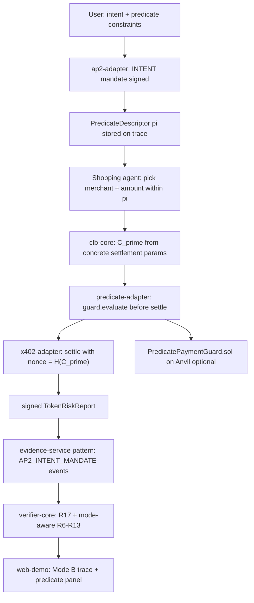
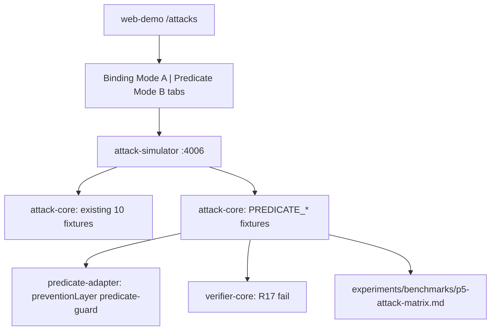

# Phase 4 — Mode B Delegated/Predicate Flow

Scope: deliver all five Phase 4 **foundation** items from [CONTEXT_FULL_PROJECT.md](CONTEXT_FULL_PROJECT.md) §21 — predicate schema, predicate guard / smart-account caveat adapter, predicate verifier, Mode B UI, gas benchmark. Stops before Phase 5 (live interactive demo over HTTP). **Phase 4 follow-up** (§21, after foundation) adds Mode B participation in the attack simulator via Option A — predicate tab on `/attacks`, P5-focused fixtures, and a separate P5 baseline matrix; build only after foundation ships.

Follows the same monorepo patterns as the [Phase 0–2 plan](/Users/md.alamin/.cursor/plans/clb-acel_mode_a_foundation_96d6e101.plan.md) and [Phase 3 plan](/Users/md.alamin/.cursor/plans/phase_3_attack_simulator_3bf9afe2.plan.md).

**Repo state:** Phases 0–3 complete. Schemas already define `SpendingPredicate`, `PredicateDescriptor`, and `VerificationMode`. [`packages/clb-core`](packages/clb-core/src/index.ts) digests predicate descriptors but has no `evaluatePredicate` or settlement-time `C'`. [`packages/verifier-core`](packages/verifier-core/src/index.ts) is Mode A only (R1–R15; hard-rejects non-`exact` descriptors). [`apps/agent-orchestrator`](apps/agent-orchestrator/src/server.ts) has no `POST /run-delegated`. `PredicatePaymentGuard.sol` is spec-only. Web demo uses [`getModeATrace()`](apps/web-demo/src/lib/mode-a-trace.ts) only. [`experiments/benchmarks/gas-report.md`](experiments/benchmarks/gas-report.md) has a Phase 4 stub row.

### Target end-to-end flow (Mode B)



**Key difference from Mode A:** human signs a **predicate** at authorization time; exact `(asset, payTo, value)` are chosen later by the agent. Settlement binds via **C'** (not the auth-time predicate digest alone):

```txt
C' = keccak256(EIP712(identity_ref, mandate_digest, predicate_id, concrete_settlement_params))
nonce = H(C')
```

Use EIP-712 for C' (same rationale as Mode A in [DECISIONS.md](DECISIONS.md)) rather than raw concatenation — keeps off-chain/on-chain parity in `PredicatePaymentGuard.sol`.

---

## Key design decisions (record in [DECISIONS.md](DECISIONS.md))

| Decision                     | Choice                                                                                                                   | Rationale                                                                                               |
| ---------------------------- | ------------------------------------------------------------------------------------------------------------------------ | ------------------------------------------------------------------------------------------------------- |
| ERC-7710 vs demo guard       | **`PredicatePaymentGuard.sol` behind `packages/predicate-adapter`**; label as demo/mock caveat layer                     | CONTEXT §7/§13.3: ERC-7710 not stable enough for v1; adapter swappable later                            |
| C' commitment shape          | New EIP-712 type `CLBSettlementCommitment` in clb-core                                                                   | Consistent with Mode A; guard contract mirrors TS encoding                                              |
| Auth-time vs settlement-time | INTENT mandate (personal-message sig, no `clbCommitment`) + settlement-time C' on trace bundle                           | Matches existing [`ap2-adapter`](packages/ap2-adapter/src/index.ts) INTENT path and CLB.md Flow B       |
| Predicate storage            | `PredicateDescriptor` on `TraceBundle.clb.settlementDescriptor`; concrete params in new `TraceBundle.concreteSettlement` | Verifier evaluates π against concrete settlement                                                        |
| R7 in Mode B                 | **Vacuous pass** when `mode === MODE_B_PREDICATE`; R17 owns predicate checks                                             | Avoid duplicate/conflicting rules                                                                       |
| R11–R13 in Mode B            | Evaluate against **predicate fields** (maxValue, allowedPayees, allowedAssets) not mandate.constraints alone             | Predicate is the authorization source in delegated flow                                                 |
| Enforcement (P5)             | In-process facilitator + optional on-chain guard both call `evaluatePredicate`                                           | Prevention at settlement for demo; verifier provides audit (R17)                                        |
| UI scope                     | Read-only **`getModeBTrace()`** + demo mode toggle; no live wallet/HTTP walkthrough                                      | Phase 5 owns interactive demo; Phase 4 proves predicate path like Phase 2 did for Mode A                |
| R16 feedback rule            | **Defer promoting to verifier-core** unless needed for Mode B happy path                                                 | Already handled in attack-core audit layer (Phase 3); add only if Mode B traces include feedback events |
| Gas benchmark                | Extend benchmarks via `scripts/e2e-phase4.ts` + `forge test --gas-report` on guard                                       | Replaces Phase 3 stub row in `gas-report.md`                                                            |

---

## 1. Predicate schema hardening (PR12a)

**Mostly exists** in [`packages/schemas/src/index.ts`](packages/schemas/src/index.ts). Minimal additions:

- Add optional `predicateRef: { predicateId: string }` on `MandateConstraintsSchema` so INTENT mandates carry a stable predicate link (constraints mirror `SpendingPredicate` fields for AP2 compatibility).
- Export `SettlementParamsSchema` — the concrete settlement slice R17 evaluates: `{ chainId, network, asset, payTo, value, validBefore, payerAgentId }`.
- Add Zod round-trip unit tests in `packages/schemas/test/predicate.test.ts`.

No breaking changes to existing Mode A types.

---

## 2. `packages/clb-core` — predicate evaluation + C' (PR12b)

Extend [`packages/clb-core/src/index.ts`](packages/clb-core/src/index.ts):

```ts
// New exports
evaluatePredicate(predicate: SpendingPredicate, params: SettlementParams, now?: Date): PredicateEvalResult
buildModeBSettlementCommitment(input: ModeBSettlementInput): CLBTypedData  // C'
computeModeBSettlementCommitment(input): Hex   // H(C')
deriveSettlementNonce(commitment: Hex): Hex    // alias of deriveNonce
settlementParamsFromExact(descriptor: SettlementDescriptorExact, agentId: string): SettlementParams
```

**Predicate evaluation rules** (mirror CONTEXT §7 minimal language + §13.3 guard checks):

- `asset ∈ allowedAssets`
- `payTo ∈ allowedPayees` (checksum-normalized)
- `value ≤ maxValue` (numeric compare, same as R11)
- `now ≤ validUntil`
- `chainId ∈ allowedChainIds`
- `agentId ∈ allowedAgentIds`
- optional `taskHash` checked when present (aligns with R15)

Add Foundry-compatible struct hash helper comments for Solidity parity.

**Tests:** `packages/clb-core/test/predicate.test.ts` — pass/fail cases for each constraint; C' stability vectors pinned like existing commitment tests.

---

## 3. `packages/predicate-adapter` — guard / caveat adapter (PR12c)

**New package** `@clb-acel/predicate-adapter` (pure TS + thin contract bridge):

```ts
interface PredicateGuardAdapter {
  evaluateOffChain(predicate, params): PredicateEvalResult;
  assertSettlementAllowed(input: GuardSettlementInput): Promise<GuardResult>; // throws on violation
}
```

Implementations:

| Adapter                  | Use                                                                                            |
| ------------------------ | ---------------------------------------------------------------------------------------------- |
| `InMemoryPredicateGuard` | Default for CI/orchestrator — calls `evaluatePredicate` from clb-core                          |
| `ContractPredicateGuard` | Optional — reads `PREDICATE_GUARD_ADDRESS` via viem `readContract` after settlement simulation |

Document in adapter README: **demo substitute for ERC-7710 smart-account caveat**; not a production delegation implementation.

Wire into [`packages/x402-adapter`](packages/x402-adapter/src/index.ts) facilitator `settle()` path when `scheme === "predicate"`: call guard before marking nonce consumed.

---

## 4. `contracts/src/PredicatePaymentGuard.sol` (PR12d)

Implement CONTEXT §13.3 checks:

```solidity
function validateAndConsume(
  bytes32 commitment,   // C'
  bytes32 nonce,        // must equal keccak256(commitment)
  address payTo,
  string calldata asset,
  uint256 value,
  uint64 validUntil,
  uint256 chainId,
  string calldata agentId,
  // predicate fields stored at registration or passed calldata
) external returns (bool);
```

- Nonce single-use mapping (P3 for Mode B)
- Predicate params stored via `registerPredicate(bytes32 predicateId, PredicateConfig)` or inline calldata for demo simplicity
- Mirror C' hashing from clb-core (shared test vectors in TS ↔ Solidity)

**Tests:** `contracts/test/PredicatePaymentGuard.t.sol` — happy path, each violation reverts, nonce replay blocked.

**Deploy:** document in [`contracts/README.md`](contracts/README.md); add `PREDICATE_GUARD_ADDRESS` to [`.env.example`](.env.example) (already listed).

---

## 5. `packages/ap2-adapter` + mandate-service — INTENT with predicate (PR12e)

**ap2-adapter:**

- Extend `IssueMandateInput` so INTENT mandates accept optional `predicate: PredicateDescriptor` stored in mandate constraints / trace metadata.
- Keep personal-message signing for INTENT (no auth-time `clbCommitment`).

**mandate-service** ([`services/mandate-service/src/server.ts`](services/mandate-service/src/server.ts)):

- `POST /mandates/intent` body accepts `PredicateDescriptorSchema` (union with existing constraints).
- `POST /mandates/verify` accepts predicate context for Mode B verification calls.

---

## 6. `packages/x402-adapter` — predicate scheme (PR12f)

Extend types:

```ts
PaymentRequirements.scheme: "exact" | "predicate"
PaymentPayload.scheme: "exact" | "predicate"
```

Add:

- `buildPredicatePaymentRequirements(predicate, resource, concreteSettlement?)` — 402 response references predicate_id + scheme
- `settlePredicate(payload, guard: PredicateGuardAdapter)` — evaluates π, computes C', checks nonce, then settles

Mode A `exact` path unchanged.

---

## 7. `packages/verifier-core` — predicate verifier (PR12g)

Extend [`packages/verifier-core/src/types.ts`](packages/verifier-core/src/types.ts):

```ts
RuleId += "R17_PREDICATE_TRUE_FOR_MODE_B"
TraceBundle += {
  concreteSettlement?: SettlementDescriptorExact  // required when mode === MODE_B_PREDICATE
  modeBCommitment?: Hex  // C' bound at settlement
}
```

Rule behavior by mode:

| Rule    | Mode A                                 | Mode B                                                       |
| ------- | -------------------------------------- | ------------------------------------------------------------ |
| R6      | Recompute C vs `mandate.clbCommitment` | Recompute C' vs `modeBCommitment`                            |
| R7      | Exact descriptor match                 | Pass (predicate checked in R17)                              |
| R8      | nonce == H(C)                          | nonce == H(C')                                               |
| R10     | chainId from exact descriptor          | chainId from concrete settlement + predicate allowedChainIds |
| R11–R13 | mandate.constraints                    | predicate fields via R17 + redundant checks                  |
| **R17** | Pass vacuously                         | `evaluatePredicate(predicate, settlementParams)`             |

Add `R17` to `RULE_ORDER` after R15. Update certificate `rulesChecked`.

**Tests:** `packages/verifier-core/test/mode-b.test.ts` — happy path PASS; violations (payee, amount, asset, expiry, chain) fail R17 with expected detail.

---

## 8. `apps/agent-orchestrator` — `runDelegated` (PR12h)

Add parallel to [`runHumanPresent`](apps/agent-orchestrator/src/flow.ts):

```ts
export async function runDelegated(intent, config?): Promise<TraceResult>;
```

Flow:

1. Resolve ERC-8004 payer + merchant agents (same seed as Mode A)
2. Build `SpendingPredicate` from intent (budget → maxValue, asset/payee allowlists from intent)
3. Issue **INTENT** mandate (user key, no human present at settlement)
4. Agent autonomously builds `SettlementDescriptorExact` within predicate
5. Compute C', derive nonce, build predicate x402 requirements, settle via guard
6. Delivery + evidence graph with `AP2_INTENT_MANDATE` (no CART/PAYMENT mandates)
7. `verifyTrace` with `mode: "MODE_B_PREDICATE"`

**HTTP:** add `POST /run-delegated` to [`server.ts`](apps/agent-orchestrator/src/server.ts) (same body shape as `/run-human-present`). Update [`docs/api-reference.md`](docs/api-reference.md).

**Tests:** `apps/agent-orchestrator/test/mode-b.test.ts` — PASS trace; optional mutate fixture failing R17.

Export `runDelegatedOverHttp` stub (mirror `http-flow.ts`) — full HTTP E2E deferred to Phase 5.

---

## 9. Mode B UI (PR12i)

Follow Phase 2 read-only pattern ([`mode-a-trace.ts`](apps/web-demo/src/lib/mode-a-trace.ts)):

| Change            | Location                                                                            |
| ----------------- | ----------------------------------------------------------------------------------- |
| `getModeBTrace()` | `apps/web-demo/src/lib/mode-b-trace.ts` — pinned intent + `runDelegated({ nowMs })` |
| Demo mode toggle  | Extend `DemoShell` / layout — **Mode A \| Mode B** switch selects trace provider    |
| Mandate screen    | Show predicate JSON + human INTENT signature (not exact cart) when Mode B           |
| Payment screen    | Show C', nonce = H(C'), predicate satisfaction badge                                |
| Verifier screen   | Display R17 outcome; copy updates to "R1–R17"                                       |
| Evidence graph    | Include `AP2_INTENT_MANDATE` node label for Mode B                                  |
| Research mode     | `ProtocolPanel` exposes `PredicateDescriptor`, C', `evaluatePredicate` result       |

No new route required — reuse existing 8 screens with mode-aware data (matches §18 screen list; predicate is a variant of mandate/payment steps).

---

## 10. Gas benchmark (PR12j)

Replace stub in [`experiments/benchmarks/gas-report.md`](experiments/benchmarks/gas-report.md):

```bash
cd contracts && forge test --match-contract PredicatePaymentGuard --gas-report
```

Add [`scripts/e2e-phase4.ts`](scripts/e2e-phase4.ts):

- Run `runDelegated` happy path in-process
- Assert verifier PASS + R17 ok
- Parse forge gas output into `gas-report.md` row for `PredicatePaymentGuard.sol`
- Root script: `"e2e:phase4": "bun run scripts/e2e-phase4.ts"`

CI ([`.github/workflows/ci.yml`](.github/workflows/ci.yml)): add step after Phase 3 benchmark.

---

## PR sequence (PR12 — foundation only)

Suggested split (single PR acceptable for research demo):

1. Schema tests + clb-core predicate/C'
2. `predicate-adapter` + x402 predicate scheme
3. `PredicatePaymentGuard.sol` + Foundry tests
4. verifier-core R17 + mode-aware rules
5. ap2-adapter + mandate-service INTENT predicate
6. orchestrator `runDelegated` + `POST /run-delegated`
7. Web demo Mode B toggle + trace
8. e2e-phase4 + gas-report + DECISIONS/README/docs

**Not in foundation PR12:** attack simulator integration (Phase 4 follow-up below).

---

## Phase 4 follow-up — Predicate attacks in simulator (Option A, PR12b)

Build **after** Phase 4 foundation is complete. Do not block foundation on this work.

**Rationale:** Phase 3’s 10 attacks prove P1–P4 binding in Mode A. Mode B’s novel contribution is **P5 predicate soundness** — not re-running the same binding stories under R17 instead of R11–R13. Option A adds a focused P5 slice without duplicating the full 10×4 matrix.

### Target architecture



### Scope (Option A)

| Item                | Detail                                                                                                                                                |
| ------------------- | ----------------------------------------------------------------------------------------------------------------------------------------------------- |
| **UI**              | `/attacks` gets two tabs: **Binding attacks (Mode A)** — existing 10 fixtures; **Predicate attacks (Mode B)** — new P5 fixtures + one happy-path PASS |
| **Fixtures**        | `buildValidModeBBundle()` from `runDelegated`; 4 violations + 1 happy path                                                                            |
| **Attack IDs**      | `PREDICATE_PAYEE_VIOLATION`, `PREDICATE_AMOUNT_VIOLATION`, `PREDICATE_ASSET_VIOLATION`, `PREDICATE_EXPIRED`, `PREDICATE_HAPPY_PATH`                   |
| **Expected rules**  | Violations fail **R17**; happy path PASS with R17 ok                                                                                                  |
| **Prevention**      | Extend `preventionLayer` to `"predicate-guard"` when guard blocks settlement before trace completes                                                   |
| **Baseline matrix** | Separate **`p5-attack-matrix.md`** (not a second 10×4 table): B0/B1 allow, B2 detects post-settlement via R17, B3 prevents at guard + R17 audit       |
| **Explicitly skip** | Re-running all 10 Mode A attacks in Mode B; decision-layer attacks (`FAKE_FEEDBACK`, `PROMPT_INJECTION`) — mode-agnostic, stay in Binding tab         |

### `packages/attack-core` (PR12b-a)

- Export `MODE_B_PREDICATE_FIXTURES` separate from `ATTACK_FIXTURES`
- `buildValidModeBBundle()` — shared base for Mode B fixtures (mirrors `buildValidBundle` pattern)
- `runPredicateAttack(id)` / `runAllPredicateAttacks()` — parallel to Phase 3 `runAttack`
- Each violation fixture mutates concrete settlement to break π; guard attempt recorded on bundle

### `services/attack-simulator` (PR12b-b)

| Endpoint                          | Purpose                               |
| --------------------------------- | ------------------------------------- |
| `GET /attacks/predicate`          | List Mode B fixture metadata          |
| `POST /attacks/predicate/:id/run` | Run single P5 fixture                 |
| `POST /benchmark/predicate`       | Run all P5 fixtures + build P5 matrix |
| `GET /benchmark/predicate/matrix` | P5 baseline matrix for UI             |

Orchestrator: optional `POST /attack/predicate/:attackName` proxy.

### Web demo `/attacks` (PR12b-c)

- shadcn **Tabs**: "Binding (Mode A)" \| "Predicate (Mode B)"
- Mode B tab: fixture selector, run button, P5 matrix table, `preventionLayer` badge (`predicate-guard` vs verifier-only)
- Research mode: full `AttackRunResult` + predicate + C' JSON

### Benchmark artifacts (PR12b-d)

```
experiments/benchmarks/
  p5-attack-matrix.md    # B0–B3 × 4 predicate violations (+ happy path row)
  p5-results.json        # full P5 benchmark run
```

Script: `scripts/e2e-phase4b.ts` + root `"e2e:phase4b"`. CI step after foundation Phase 4 e2e passes.

### PR sequence (PR12b)

1. `attack-core` Mode B bundle + P5 fixtures
2. `attack-simulator` predicate endpoints
3. `/attacks` tab UI + P5 matrix
4. `e2e-phase4b` + `p5-attack-matrix.md` + DECISIONS.md

### Success criteria (follow-up)

1. Open `/attacks` → **Predicate (Mode B)** tab, run `PREDICATE_AMOUNT_VIOLATION`, see R17 FAIL and guard prevention where applicable
2. Run `bun run e2e:phase4b` — reproducible P5 matrix artifact
3. Paper can cite P5 evaluation separately from Phase 3 binding matrix without redundant Mode A duplication

---

## PR sequence note

Foundation (PR12) and follow-up (PR12b) may land as separate PRs or sequential commits on the same branch. Foundation must not depend on PR12b.

---

## Verification checklist (subset of CONTEXT §23)

- Unit: `evaluatePredicate` pass/fail vectors; C' EIP-712 stability; guard nonce replay
- Integration: Mode B happy trace PASS (R17 ok); predicate violation FAIL (R17)
- Contract: `forge test` green including gas report
- UI: toggle Mode B, verifier shows R17 PASS on pinned trace
- Artifacts: `gas-report.md` populated with real PredicatePaymentGuard numbers

---

## Explicitly out of scope

**Phase 4 foundation (PR12):**

- Attack simulator Mode B integration — Phase 4 follow-up (PR12b, Option A)
- Re-running all 10 Mode A attacks in Mode B — redundant; see follow-up rationale

**Phase 5+:**

- Live interactive delegated walkthrough (browser wallet signs INTENT, HTTP-only orchestrator) — Phase 5
- Full ERC-7710 / ERC-4337 smart-account delegation — research extension; adapter interface only
- Tamarin formal model for P5 — Phase 6 / research
- Promoting R16 into verifier-core unless Mode B traces include feedback events
- AWS / encrypted payloads — Phase 6

---

## Success criteria

**After Phase 4 foundation (PR12):**

1. Toggle **Mode B** in the web demo and see a complete delegated trace with predicate constraints, C', and R17 PASS
2. Run `bun run e2e:phase4` for a reproducible Mode B verification + gas numbers
3. Cite predicate guard gas cost from `experiments/benchmarks/gas-report.md` alongside Phase 3 anchor metrics
4. Demonstrate P5 in-process: settlement blocked when π is violated (guard/facilitator) and detected by R17 in evidence audit

**After Phase 4 follow-up (PR12b, Option A):**

5. Open `/attacks` → **Predicate (Mode B)** tab and run P5 violation fixtures with guard prevention + R17 FAIL
6. Run `bun run e2e:phase4b` and cite `experiments/benchmarks/p5-attack-matrix.md` for P5 baseline evaluation
