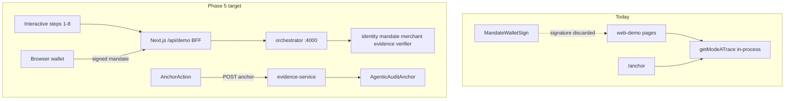
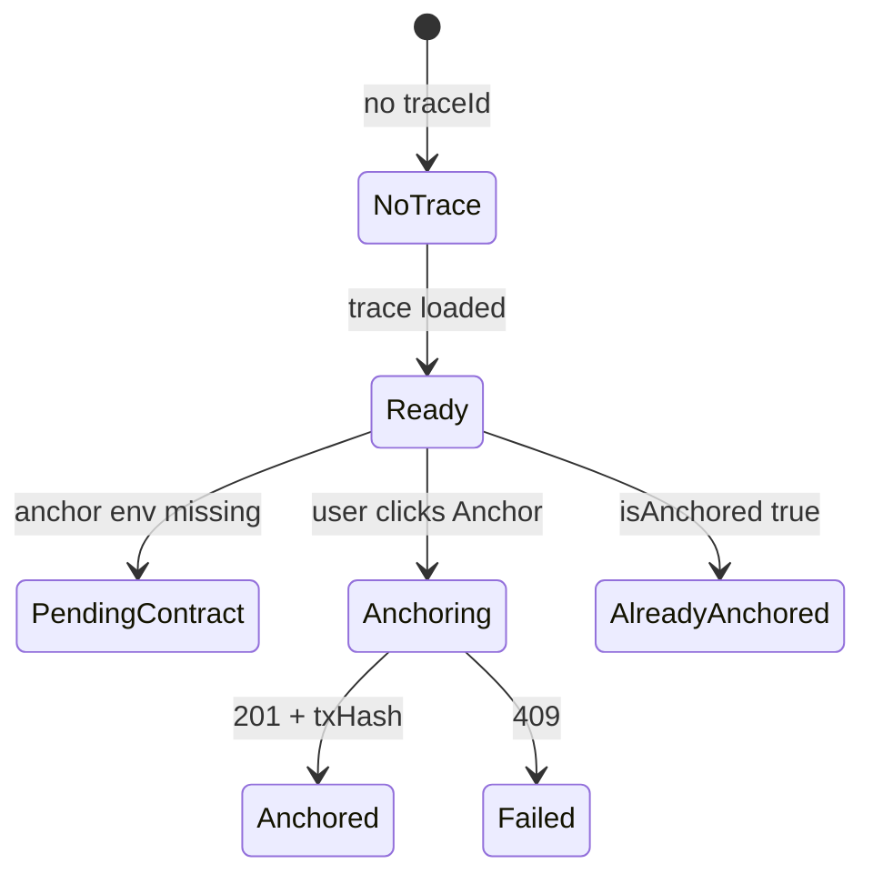

# Phase 5 — Interactive Demo + Anchor UI

## Current state (Phases 0–4 complete)

The web demo still runs **in-process** via [`getModeATrace()`](apps/web-demo/src/lib/mode-a-trace.ts) on steps 1–6 and 8. [`getModeBTrace()`](apps/web-demo/src/lib/mode-b-trace.ts) and [`ModeSwitch`](apps/web-demo/src/components/mode-switch.tsx) exist but are **unused**. Wallet signing on [`/mandate`](<apps/web-demo/src/app/(demo)/mandate/page.tsx>) is a **side demo** — signature never reaches orchestrator.

Backend readiness is asymmetric:

| Capability                              | Status                                                                                                 |
| --------------------------------------- | ------------------------------------------------------------------------------------------------------ |
| Mode A HTTP (`runHumanPresentOverHttp`) | Done — [`http-flow.ts`](apps/agent-orchestrator/src/http-flow.ts)                                      |
| Mode B HTTP (`runDelegatedOverHttp`)    | **Stub** — throws                                                                                      |
| Evidence anchor API                     | Done — `POST /traces/:traceId/anchor` in [`evidence-service`](services/evidence-service/src/server.ts) |
| Verifier certificate API                | Done — `GET /verify/:traceId/certificate`                                                              |
| Browser → service calls from UI         | **None** — no CORS, no BFF routes                                                                      |
| Anchor UI                               | **Read-only** — no action, no tx/status                                                                |



---

## Architecture decisions (add to [`DECISIONS.md`](DECISIONS.md))

| Decision           | Choice                                                                                              | Rationale                                                                      |
| ------------------ | --------------------------------------------------------------------------------------------------- | ------------------------------------------------------------------------------ |
| Demo data path     | **Live HTTP only on happy path**                                                                    | Phase 5 spec; remove in-process fallback from primary screens                  |
| Cross-page state   | `DemoRunProvider` + `sessionStorage` + URL `?traceId=`                                              | Walkthrough needs shared trace across 8 steps without re-running flow          |
| Browser → backend  | **Next.js Route Handlers** under `apps/web-demo/src/app/api/demo/`                                  | Avoids CORS on 6 Fastify services; keeps service URLs server-side              |
| Wallet integration | `POST /mandates/register` on mandate-service + orchestrator accepts `mandateId`                     | Human signs in browser; services verify signature via existing `verifyMandate` |
| Mode B wallet      | New `IntentWalletSign` — personal-message sign over mandate digest (INTENT)                         | Matches [`ap2-adapter`](packages/ap2-adapter/src/index.ts) INTENT path         |
| Chain default      | Anvil (`CHAIN_ID=31337`, `RPC_URL=http://127.0.0.1:8545`)                                           | CI/local; document Base Sepolia switch in demo script                          |
| In-process traces  | Keep `getModeATrace`/`getModeBTrace` for **unit/build only** or research-mode “replay pinned trace” | Not used on default happy path                                                 |

---

## 1. Backend — wallet-signed mandates + Mode B HTTP

### 1a. Mandate-service: register externally signed mandates

Add `POST /mandates/register` in [`services/mandate-service/src/server.ts`](services/mandate-service/src/server.ts):

- Body: full `Mandate` (including `signature`, optional `clbCommitment`)
- Validate with `verifyMandate()` (+ `clb` context for CART/PAYMENT)
- Store in existing in-memory map; return **201**

Add helper in [`packages/ap2-adapter`](packages/ap2-adapter/src/index.ts):

```ts
export function attachMandateSignature(
  authorization: Omit<Mandate, "signature" | "clbCommitment">,
  input: { signature: Hex; clbCommitment?: Hex; clb?: CLBCommitmentInput },
): Mandate;
```

Used by web-demo BFF to assemble mandate drafts before wallet signing.

### 1b. Extend HTTP orchestrator flows for wallet mandates

Update [`runHumanPresentOverHttp`](apps/agent-orchestrator/src/http-flow.ts):

- New option: `{ mandateId?: string }` — if set, `GET /mandates/:mandateId` instead of `POST /mandates/cart`
- Recompute `commitment`/`nonce` from fetched mandate (same as today)

Update [`POST /run-human-present`](apps/agent-orchestrator/src/server.ts) body schema:

```ts
{ intentId?, mandateId?, transport?: "http" | "in-process", ...intentFields }
```

### 1c. Implement `runDelegatedOverHttp`

Mirror Mode A pattern in [`http-flow.ts`](apps/agent-orchestrator/src/http-flow.ts) following in-process [`runDelegated`](apps/agent-orchestrator/src/flow.ts):

1. `GET /agents/:id` (payer + merchant)
2. `GET /mandates/:mandateId` (INTENT with predicate) **or** skip if mandate passed
3. Merchant predicate payment requirements + settle via HTTP merchant API
4. `POST /events` ×7 to evidence-service
5. `POST /verify/:traceId` to verifier-service with Mode B bundle (`modeBCommitment`, `concreteSettlement`, R17)

Wire [`POST /run-delegated`](apps/agent-orchestrator/src/server.ts):

```ts
body.transport === "http" || ORCHESTRATOR_TRANSPORT=http
  ? runDelegatedOverHttp(intent, { mandateId })
  : runDelegated(intent)
```

Add integration test extending [`apps/agent-orchestrator/test/http-flow.test.ts`](apps/agent-orchestrator/test/http-flow.test.ts) — register INTENT mandate, run delegated over HTTP, assert R17 PASS.

### 1d. Optional prepare endpoints (reduce client complexity)

Add lightweight orchestrator routes (or BFF-only logic):

- `POST /prepare/human-present` → `{ payerAgent, merchantAgent, settlementDescriptor, clbDomain, mandateDraft }` (no signing)
- `POST /prepare/delegated` → `{ payerAgent, merchantAgent, predicateDescriptor, mandateDraft }`

These let the mandate page build the exact typed data the wallet must sign **before** calling `/run-*`.

---

## 2. Web-demo BFF API routes

Create Route Handlers in [`apps/web-demo/src/app/api/demo/`](apps/web-demo/src/app/api/demo/):

| Route                                   | Proxies to                                            | Purpose                               |
| --------------------------------------- | ----------------------------------------------------- | ------------------------------------- |
| `POST /api/demo/intent`                 | orchestrator `POST /intent`                           | Create intent from form               |
| `POST /api/demo/prepare`                | orchestrator prepare endpoint                         | Mandate signing payload               |
| `POST /api/demo/mandates/register`      | mandate-service                                       | Store wallet-signed mandate           |
| `POST /api/demo/run`                    | orchestrator `/run-human-present` or `/run-delegated` | Start live flow (`transport: "http"`) |
| `GET /api/demo/trace/[traceId]`         | orchestrator `GET /trace/:id`                         | Trace summary for steps 4–6           |
| `GET /api/demo/evidence/[traceId]`      | evidence-service graph + merkle                       | Step 5 live graph                     |
| `GET /api/demo/verify/[traceId]`        | verifier-service certificate                          | Step 6 live certificate               |
| `POST /api/demo/anchor/[traceId]`       | evidence-service anchor                               | Step 8 on-chain action                |
| `GET /api/demo/anchor/[traceId]/status` | evidence merkle + optional `isAnchored` RPC read      | Anchor page state                     |

Add to [`.env.example`](.env.example):

```bash
NEXT_PUBLIC_DEMO_CHAIN_ID=31337
RPC_URL=http://127.0.0.1:8545   # explicit; anchor-core already reads this
AGENT_ORCHESTRATOR_URL=http://localhost:4000
# ...existing service URLs...
```

Document Base Sepolia switch: set `CHAIN_ID=84532`, `RPC_URL_BASE_SEPOLIA`, deploy anchor, fund wallet.

---

## 3. Demo session + interactive UI (steps 1–7)

### 3a. Shared session context

New [`apps/web-demo/src/components/demo-run-provider.tsx`](apps/web-demo/src/components/demo-run-provider.tsx):

- State: `{ mode: "a" | "b", intentId, traceId, mandateId, runStatus, error }`
- Persist to `sessionStorage`; sync `traceId` to URL (`?traceId=...&mode=b`)
- Wrap in [`layout.tsx`](<apps/web-demo/src/app/(demo)/layout.tsx>)

Wire [`ModeSwitch`](apps/web-demo/src/components/mode-switch.tsx) into [`DemoLayoutShell`](apps/web-demo/src/components/demo-shell.tsx) with visitor copy from [`demo-copy.ts`](apps/web-demo/src/lib/demo-copy.ts).

Update shell branding: replace hardcoded **"Mode A Foundation"** / **"Mode A · live"** badges with mode-aware labels (`FLOW_LABELS`) and honest status (`Ready` → `Running` → `Live trace`).

### 3b. Step-by-step changes

| Step        | File                                                                      | Change                                                                                                   |
| ----------- | ------------------------------------------------------------------------- | -------------------------------------------------------------------------------------------------------- |
| 1 Intent    | [`intent/page.tsx`](<apps/web-demo/src/app/(demo)/intent/page.tsx>)       | Client form (task, token, budget, asset); `POST /api/demo/intent`; "Continue" enables step 2             |
| 2 Discovery | [`discovery/page.tsx`](<apps/web-demo/src/app/(demo)/discovery/page.tsx>) | Fetch agents from BFF/prepare (live identity-service); empty state if no intent                          |
| 3 Mandate   | [`mandate/page.tsx`](<apps/web-demo/src/app/(demo)/mandate/page.tsx>)     | Mode A: extend `MandateWalletSign` → register + run. Mode B: new `IntentWalletSign` for predicate INTENT |
| 4 Payment   | [`payment/page.tsx`](<apps/web-demo/src/app/(demo)/payment/page.tsx>)     | Show live settlement from trace; trigger run if not yet started; loading/error UI                        |
| 5 Evidence  | [`evidence/page.tsx`](<apps/web-demo/src/app/(demo)/evidence/page.tsx>)   | Fetch `GET /api/demo/evidence/:traceId`; badge **"Live evidence-service"**; no mock fallback             |
| 6 Verifier  | [`verifier/page.tsx`](<apps/web-demo/src/app/(demo)/verifier/page.tsx>)   | Fetch certificate from verifier-service; show R1–R17 for Mode B                                          |
| 7 Attacks   | Already live                                                              | Verify Binding/Predicate tabs still work; no stub metadata on primary path                               |

**Run trigger UX (recommended):** Mandate page = sign + "Run payment" button calls `POST /api/demo/run` then navigates to `/payment?traceId=...`. Steps 5–8 require `traceId` or show guided empty state.

### 3c. Wallet signing wired into flow

Refactor [`mandate-wallet-sign.tsx`](apps/web-demo/src/components/mandate-wallet-sign.tsx):

- Accept `onSigned({ signature, humanPrincipal, mandate })` callback
- After sign → BFF register → store `mandateId` in session
- Remove misleading "Demo trace commitment (Anvil key)" copy on happy path
- Validate connected address matches mandate `humanPrincipal`

New `intent-wallet-sign.tsx` for Mode B: `signMessage({ raw: mandateDigest })` per ap2-adapter INTENT path.

---

## 4. Anchor UI overhaul (step 8)

Replace read-only [`anchor/page.tsx`](<apps/web-demo/src/app/(demo)/anchor/page.tsx>) with server shell + client [`anchor-action.tsx`](apps/web-demo/src/components/anchor-action.tsx):

**Fixes / features:**

1. **Anchor button** — `POST /api/demo/anchor/:traceId` (proxies evidence-service)
2. **Status machine** — `idle` → `anchoring` → `ANCHORED` | `PENDING_CONTRACT` (202) | `ANCHOR_FAILED` (409)
3. **Correct traceHash** — display `computeTraceHash({ traceId, merkleRoot, eventHashes })` from `@clb-acel/anchor-core`, **not** certificate hash (current bug in ProtocolPanel)
4. **On-chain read-back** — `isAnchored(traceId)` via public client; show "Already anchored" if true
5. **Tx feedback** — show `txHash`, contract address, block explorer link (Anvil: disable link; Base Sepolia: basescan)
6. **Prerequisites panel** — when env missing, show checklist (`AUDIT_ANCHOR_ADDRESS`, `RPC_URL`, `DEPLOYER_PRIVATE_KEY`, Anvil running)
7. **Empty state** — no `traceId` in session → "Complete steps 1–6 first"
8. **Research mode** — retain `ProtocolPanel` with full anchor payload



---

## 5. Cleanup + verification

### Remove / repurpose dead code

- Delete or archive [`stub-data.ts`](apps/web-demo/src/lib/stub-data.ts) (unused)
- Repurpose [`evidence-trace.ts`](apps/web-demo/src/lib/evidence-trace.ts) → thin client for BFF or delete if BFF subsumes it
- Stop importing `getModeATrace` from demo pages (keep module for optional research-mode pinned replay)

### E2E scripts

**[`scripts/e2e-phase5.ts`](scripts/e2e-phase5.ts)** (new, `e2e:phase5` in root [`package.json`](package.json)):

1. Health-check all services (reuse phase2 helpers)
2. Mode A: `POST /intent` → register mandate (server key simulating wallet) → `POST /run-human-present` `transport:http`
3. Mode B: register INTENT mandate → `POST /run-delegated` `transport:http` → assert R17 PASS
4. Evidence graph + verifier certificate GET
5. Optional anchor step (skip if no contract env, like phase2)

**Playwright** (add `@playwright/test` to web-demo devDeps):

- [`apps/web-demo/e2e/demo-walkthrough.spec.ts`](apps/web-demo/e2e/demo-walkthrough.spec.ts)
- Mock wallet injection OR use Anvil account #0 via `window.ethereum` stub
- Click path: intent form → run → evidence badge → anchor button
- Run locally / optional CI job (services + Anvil required) — not blocking default CI initially

### Docs

- Update [`DECISIONS.md`](DECISIONS.md) Phase 5 section (deferrals resolved)
- Add [`docs/demo-walkthrough.md`](docs/demo-walkthrough.md): start services, deploy anchor, Anvil vs Base Sepolia, full click-through
- Update [`README.md`](README.md) Phase 5 checkbox

---

## PR sequence (suggested)

1. **Backend:** mandate register + `runDelegatedOverHttp` + orchestrator body extensions + tests
2. **BFF routes** + env/docs
3. **DemoRunProvider** + interactive intent/mandate/run (Mode A end-to-end)
4. **Mode B** wallet + delegated run + mode switch in shell
5. **Evidence/verifier/anchor live pages** + anchor-action component
6. **Cleanup** + `e2e:phase5` + Playwright + DECISIONS/README

---

## Success criteria

1. Start services + Anvil → open `/intent` → fill form → sign mandate in MetaMask → run completes → evidence graph loads from Postgres via evidence-service
2. Toggle Mode B → sign INTENT predicate → delegated run completes → verifier shows **R17 PASS**
3. `/anchor` → click Anchor → see tx hash (or clear `PENDING_CONTRACT` message with setup instructions)
4. `bun run e2e:phase5` passes Mode A + Mode B HTTP paths
5. No in-process mock trace on default happy path; research mode toggle still exposes protocol JSON
6. Switching to Base Sepolia via `.env` documented and works with same UI flow

---

## Explicitly out of scope (Phase 6)

- AWS deployment, encrypted evidence payloads
- Verifier/evidence persistence across service restarts
- Full ERC-7710 smart-account delegation
- Tamarin formal models
