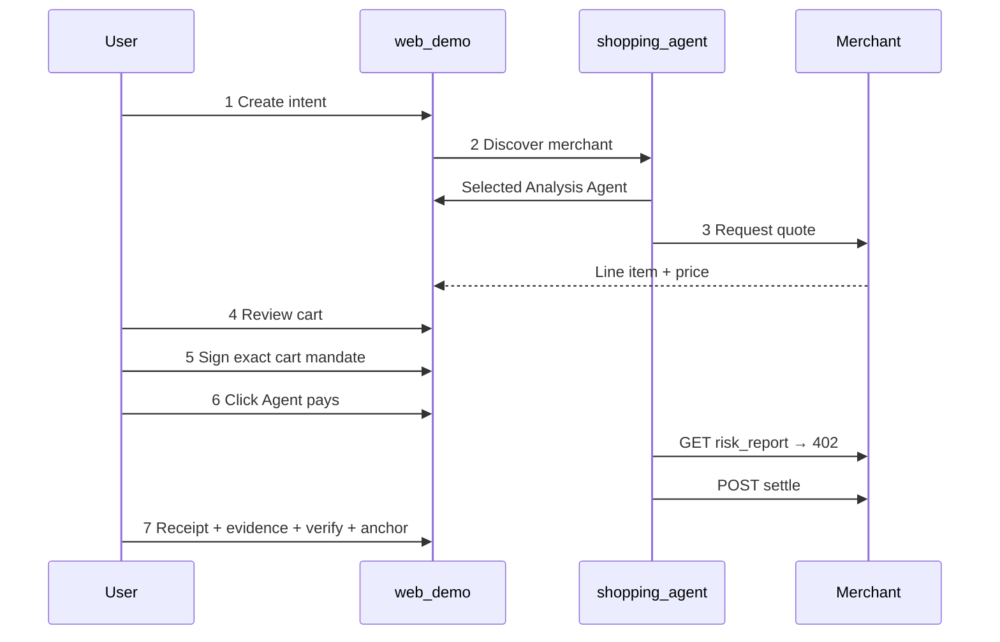
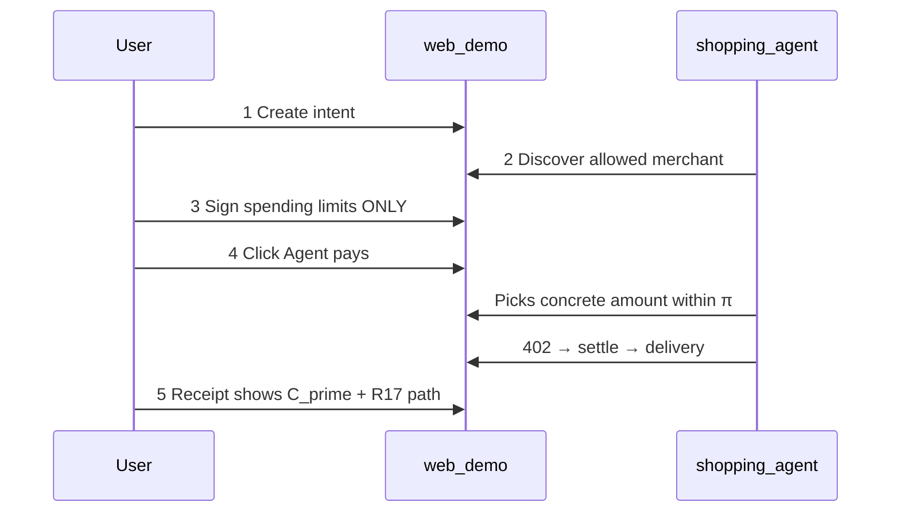
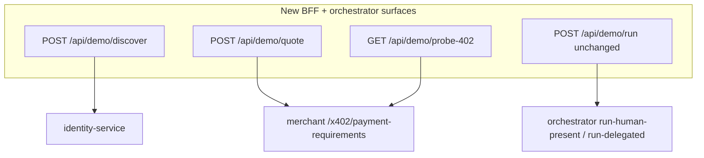

# Phase 5b — Agent Commerce Narrative UX

## Problem statement

Phase 5 wired live services correctly, but the UI still reads as a **protocol inspector**:

- Discovery auto-fetches fixed agents with no “agent working” moment ([`discovery/page.tsx`](<apps/web-demo/src/app/(demo)/discovery/page.tsx>))
- No quote/cart before authorization — “CART” is only a mandate badge
- Mandate **sign + run** are bundled ([`mandate-wallet-sign.tsx`](apps/web-demo/src/components/mandate-wallet-sign.tsx) lines 224–246), so payment completes before the user reaches step 4
- Payment page is usually **forensic replay** ([`payment/page.tsx`](<apps/web-demo/src/app/(demo)/payment/page.tsx>))

Phase 5b fixes the **story arc**, not the crypto stack.

---

## Target user journeys

### Mode A — “You approve each payment”



### Mode B — “You set limits, agent pays”



**Your preference:** Mode B requires one extra **“Agent pays”** click on checkout (no second signature).

---

## New screen map (10 steps)

Insert **Quote** and **Agent checkout**; reframe Payment as receipt.

| Step | Route           | Label (visitor)               | Actor                      |
| ---- | --------------- | ----------------------------- | -------------------------- |
| 1    | `/intent`       | Tell your agent what you need | Human                      |
| 2    | `/discovery`    | Agent finds a merchant        | Shopping agent             |
| 3    | **`/quote`**    | **Quote / cart**              | Agent + merchant           |
| 4    | `/mandate`      | Authorize payment             | Human (sign only)          |
| 5    | **`/checkout`** | **Agent checkout**            | Shopping agent (402 → pay) |
| 6    | `/payment`      | Payment receipt               | Read-only                  |
| 7    | `/evidence`     | Evidence graph                | Read-only                  |
| 8    | `/verifier`     | Audit result                  | Read-only                  |
| 9    | `/attacks`      | Attack simulator              | Optional                   |
| 10   | `/anchor`       | On-chain anchor               | Human click (backend tx)   |

Update [`demo-nav.ts`](apps/web-demo/src/lib/demo-nav.ts), sidebar pills, Playwright path, and [`docs/demo-walkthrough.md`](docs/demo-walkthrough.md).

---

## Architecture (minimal backend change)



**Principle:** reuse existing [`prepareHumanPresentOverHttp`](apps/agent-orchestrator/src/http-flow.ts) / [`prepareDelegatedOverHttp`](apps/agent-orchestrator/src/http-flow.ts) data; add thin wrappers for discovery narrative and quote packaging. **Do not** change verifier, evidence, or CLB rules.

---

## 1. Session state extensions

Extend [`DemoRunProvider`](apps/web-demo/src/components/demo-run-provider.tsx):

```ts
type DemoRunState = {
  // existing: mode, intentId, mandateId, traceId, runStatus, error
  discovery?: { selectedMerchantId: string; activity: AgentActivityEvent[] };
  quote?: CartQuote; // Mode A line item; Mode B shows limits + estimated offer
  checkoutStage?: CheckoutStage; // idle | probing_402 | settling | complete | error
};
```

Add **step gating helpers** in [`apps/web-demo/src/lib/demo-gates.ts`](apps/web-demo/src/lib/demo-gates.ts):

| Step      | Requires                             |
| --------- | ------------------------------------ |
| Discovery | `intentId`                           |
| Quote     | `discovery.selectedMerchantId`       |
| Mandate   | Mode A: `quote`; Mode B: `discovery` |
| Checkout  | `mandateId`                          |
| Payment+  | `traceId`                            |

Each page shows a friendly empty state + **Continue** CTA instead of silent sidebar-only navigation.

---

## 2. Backend — discover + quote + 402 probe

### 2a. Orchestrator: `POST /agent/discover`

Add to [`apps/agent-orchestrator/src/server.ts`](apps/agent-orchestrator/src/server.ts):

- Input: `{ intentId }` (resolve intent from in-memory map)
- Logic (new `discoverAgentsForIntent()` in [`http-flow.ts`](apps/agent-orchestrator/src/http-flow.ts)):
  1. Fetch shopping agent + analysis merchant (existing `fetchDefaultAgents`)
  2. Optionally fetch **one decoy** agent card from new seed entry (see 2d)
  3. Build deterministic `activity[]` timeline with delays metadata (timestamps only — UI animates)
  4. Return `{ payerAgent, candidates[], selectedMerchant, activity, rationale }`

Scoring is **heuristic, not LLM**: prefer agent with `x402` + `supportedProtocols` match + intent token in description. Always selects `analysis-agent-001` in happy path.

### 2b. Orchestrator: `POST /agent/quote`

- Input: `{ intentId, mode }`
- Mode A: call merchant `GET /x402/payment-requirements?token=` + build **CartQuote**:
  - `product`: “Token-risk report for {token}”
  - `merchantName`, `price`, `asset`, `payee`, `settlementDescriptor`
- Mode B: return **DelegationQuote**:
  - spending ceiling from intent budget
  - allowed payee(s) from predicate prepare
  - note: “Agent will choose exact amount at checkout”
- Does **not** settle or register mandate

### 2c. BFF routes

| Route                            | Proxies                                             |
| -------------------------------- | --------------------------------------------------- |
| `POST /api/demo/discover`        | orchestrator `/agent/discover`                      |
| `POST /api/demo/quote`           | orchestrator `/agent/quote`                         |
| `GET /api/demo/probe-402?token=` | merchant `GET /risk-report?token=` (expect **402**) |

Probe-402 gives a **real** pre-settlement 402 payload for the checkout climax without running the full orchestrator.

### 2d. Optional decoy merchant (recommended)

Add `analysis-agent-002` decoy in [`services/identity-service/src/seed.ts`](services/identity-service/src/seed.ts):

- Name: “Unverified Token Scanner”
- Missing x402 or inactive status → rejected in discovery log

Keeps selection deterministic while showing **agent choice**, not human picker.

---

## 3. Frontend components (new shared UI)

Create under [`apps/web-demo/src/components/agent/`](apps/web-demo/src/components/agent/):

| Component              | Purpose                                                                                              |
| ---------------------- | ---------------------------------------------------------------------------------------------------- |
| `AgentActivityLog`     | Scrolling timeline: “Searching registry…”, “Comparing agents…”, “Selected Token Risk Analysis Agent” |
| `CartQuoteCard`        | Commerce line item: product, merchant, price, payee (Mode A)                                         |
| `DelegationLimitsCard` | Max budget, allowed assets/payees, expiry (Mode B mandate preview)                                   |
| `CheckoutTimeline`     | Steps: `Probe 402` → `Authorize payment payload` → `Settle` → `Delivery` with live status            |
| `StepContinueButton`   | Gated navigation to next step                                                                        |

Copy lives in [`demo-copy.ts`](apps/web-demo/src/lib/demo-copy.ts) — add `AGENT_ACTIVITY`, `QUOTE`, `CHECKOUT` sections. Research mode still shows protocol IDs.

---

## 4. Page-by-page changes

### Step 1 — Intent ([`intent/page.tsx`](<apps/web-demo/src/app/(demo)/intent/page.tsx>))

- After submit, show **agent acknowledgment** card: “Shopping agent received your task” (uses intent task text)
- Minor copy shift: “Tell your shopping agent…” vs “Create live intent…”

### Step 2 — Discovery (rewrite [`discovery/page.tsx`](<apps/web-demo/src/app/(demo)/discovery/page.tsx>))

- Call `POST /api/demo/discover` instead of `/prepare`
- Show `AgentActivityLog` animating through `activity[]` (~2–3s staged with `setTimeout` / CSS)
- Highlight **selected** merchant card; show decoy as “Not selected”
- **Continue to quote** button when complete
- Remove protocol-table-first layout; tables move to research mode panel

### Step 3 — Quote (new [`quote/page.tsx`](<apps/web-demo/src/app/(demo)/quote/page.tsx>))

**Mode A:**

- Fetch `POST /api/demo/quote`
- `CartQuoteCard`: “Token-risk report for PEPE — 2.00 USDC” from live merchant requirements
- **Continue to authorize** → `/mandate`

**Mode B:**

- `DelegationLimitsCard`: what user **will** sign (max budget, allowed merchant)
- Copy: “You have not paid yet — you’re setting rules for your agent”
- **Continue to set limits** → `/mandate`

Store `quote` in session.

### Step 4 — Mandate ([`mandate/page.tsx`](apps/web-demo/src/components/mandate-wallet-sign.tsx), [`intent-wallet-sign.tsx`](apps/web-demo/src/components/intent-wallet-sign.tsx))

**Critical change — split sign from run:**

| Before                         | After                                                             |
| ------------------------------ | ----------------------------------------------------------------- |
| `signRegisterAndRun()`         | `signAndRegister()` only                                          |
| Redirect to `/payment`         | Redirect to `/checkout`                                           |
| Button: “Sign and run payment” | Mode A: “Sign cart authorization”; Mode B: “Sign spending limits” |

- Prepare uses quote/settlement from session (avoid second merchant fetch mismatch)
- Show cart summary above sign panel (Mode A) / limits summary (Mode B)
- After register: `updateRun({ mandateId, runStatus: "ready" })` — **no** `POST /api/demo/run`

### Step 5 — Checkout (new [`checkout/page.tsx`](<apps/web-demo/src/app/(demo)/checkout/page.tsx>))

**The dramatic step:**

1. On mount: show agent persona (“Shopping Research Agent is purchasing…”)
2. User clicks **Agent pays** (Mode A and Mode B)
3. Stage A — `GET /api/demo/probe-402` → display real **402 Payment Required** card (merchant body)
4. Stage B — `POST /api/demo/run` → `checkoutStage: settling`
5. On success → `traceId`, redirect to `/payment?traceId=...`

`CheckoutTimeline` reflects stages; on failure, show error with retry.

Mode B copy after run: “Agent chose {value} {asset} to {merchant} — within your signed limits.”

### Step 6 — Payment (refocus [`payment/page.tsx`](<apps/web-demo/src/app/(demo)/payment/page.tsx>))

- Rename visitor title to **Payment receipt**
- Remove primary **Run payment** button when trace exists (keep as debug-only in research mode)
- Lead with settlement summary; move nonce/402 JSON to research panel
- Mode B: show `concreteSettlement`, `modeBCommitment`, predicate satisfied badge

### Steps 7–10

Evidence, verifier, anchor: mostly unchanged; add **step gating** empty states and “Continue” links from payment receipt.

---

## 5. Mode differences summary

|                      | Mode A                                    | Mode B                                          |
| -------------------- | ----------------------------------------- | ----------------------------------------------- |
| Quote step           | Exact cart line item                      | Spending limits preview (no exact price yet)    |
| Mandate              | CART + EIP-712 C                          | INTENT + personal_sign π                        |
| Human crypto actions | **One** signature                         | **One** signature                               |
| Checkout             | User clicks Agent pays; sees 402 → settle | Same manual click; UI shows agent-picked amount |
| Payment receipt      | nonce = H(C)                              | nonce = H(C′), R17 mention                      |

---

## 6. Nav, shell, and copy

- [`demo-shell.tsx`](apps/web-demo/src/components/demo-shell.tsx): update brand from “Mode A Foundation” to mode-aware [`FLOW_LABELS`](apps/web-demo/src/lib/demo-copy.ts)
- Status badge reflects `checkoutStage` / `runStatus` honestly
- [`mode-switch.tsx`](apps/web-demo/src/components/mode-switch.tsx): clearing quote/discovery on mode change

---

## 7. Tests and docs

| Item                                                                                     | Action                                                                            |
| ---------------------------------------------------------------------------------------- | --------------------------------------------------------------------------------- |
| [`e2e/demo-walkthrough.playwright.ts`](apps/web-demo/e2e/demo-walkthrough.playwright.ts) | Extend path: intent → discovery → quote → mandate sign → checkout click → payment |
| `scripts/e2e-phase5b.ts` (optional)                                                      | API smoke: discover + quote + probe-402 + run                                     |
| [`DECISIONS.md`](DECISIONS.md)                                                           | Phase 5b section: narrative UX, sign/run split, simulated discovery               |
| [`docs/demo-walkthrough.md`](docs/demo-walkthrough.md)                                   | Presenter script for 5-min Mode A + Mode B                                        |
| Orchestrator tests                                                                       | Unit test `discoverAgentsForIntent` always selects analysis-agent-001             |

---

## PR sequence

1. Session gates + nav (10 steps) + copy — UI skeleton, no behavior break
2. Backend discover/quote/probe-402 + BFF routes + decoy seed
3. Discovery + quote pages + AgentActivityLog / CartQuoteCard
4. Split mandate sign from run; checkout page + CheckoutTimeline
5. Payment receipt refocus + step CTAs + shell badges
6. Playwright + docs + DECISIONS

---

## Explicitly out of scope

- Real LLM agent selection or chat UI
- Multi-merchant marketplace (beyond one decoy for narrative)
- Changing orchestrator settlement logic, verifier rules, or evidence schema
- Wallet signing at checkout (human signs only at mandate)
- Auto-run Mode B checkout (per your choice: manual **Agent pays** click)

---

## Success criteria

1. Presenter can say: “The agent found a merchant, got a quote, I signed once, then watched it hit 402 and pay.”
2. Mode B: only **one** wallet signature; checkout shows agent-chosen settlement within π
3. Payment step never runs before checkout; 402 payload is visible before settlement
4. Discovery shows animated agent activity, not static registry dump
5. Existing Phase 5 E2E HTTP paths still pass; Playwright covers new click path
