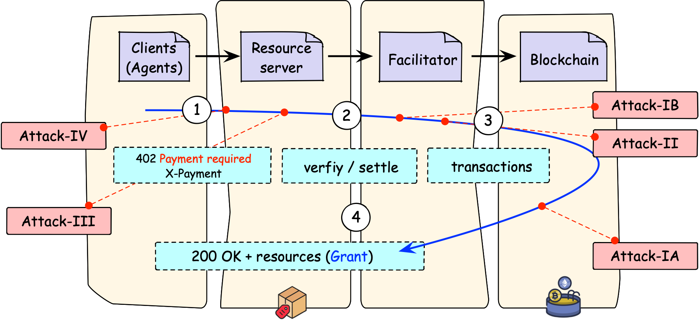

# x402 Protocol Security Analysis

This repository is the artifact for our x402 security paper. It contains
the local Hardhat testbed, live Base Sepolia reproduction scripts, and
sanitized JSON evidence used by the paper. Endpoint URLs, wallets, and
API keys are supplied at runtime through `.env`; committed live evidence
uses anonymized endpoint labels and fingerprints.

## Artifact Architecture



The diagram shows the artifact scope rather than a single deployment.
Local experiments use Hardhat and MockUSDC; live validation scripts use
Base Sepolia and operator-supplied endpoints.

## Paper-to-Artifact Map

| Paper attack | Main script(s) | Main result file(s) | Paper-facing result |
|---|---|---|---|
| I-A: revert-grant under optimistic execution | `npm run attack1a` | `results/attack1/attack1_analytic.json` | 5,000 requests per condition; RGP_0 reaches 5.18% in the fixed `T_b=2s` main sweep; Byzantine facilitator control reaches 100%. |
| I-B: settlement preemption | `npm run attack1b:permit2`; `TARGET_URL=... npm run attack1b:eip3009` | `results/attack1/permit2_frontrun.json`; EIP-3009 tx hash cited in the paper | Base Sepolia authorization preemption: payment succeeds on-chain, later facilitator settlement fails, and the client receives HTTP 402 in the EIP-3009 endpoint trace. |
| II: replay / missing idempotency | `npm run attack2`; `node src/testnet-client/run-dgr-1000.js` | `results/attack2/attack2_real.json`; `results/attack2/attack2_live_dgr_evidence_sanitized.json` | Local replay gives DGR = n without idempotency and DGR = 1 with idempotency; live Endpoint-2 evidence records 248 HTTP grants for one on-chain settlement in the positive round. |
| III: proxy/cache handling | `npm run attack3`; `node src/testnet-client/run-multi-server.js` | `results/attack3/attack3.json`; `results/attack3/live_cache_endpoint1_sanitized.json` | Local nginx leaks paid content without `Cache-Control` and stops leaking with `no-store, private`; Caddy does not leak in the local test; MitM duplicate-header injection exposes parser ambiguity. Live Endpoint-1 evidence shows publicly cacheable paid content. |
| IV: server-selection manipulation | `npm run attack4:e1`; `npm run attack4:e2`; `npm run attack4:bazaar` | `results/attack4/attack4_e1_*.json`; `results/attack4/attack4_e2_sybil_*.json`; `results/attack4/cdp_bazaar_catalog_pretty.json` | E1 metadata manipulation reaches 71.8% selection on MiniMax-M2.7, 69.4% on GPT-5.3, and 68.8% on Sonnet 4.5; E2 Sybil flooding reaches 60.2% at five Sybils in the paper aggregate. |

Rate metrics in the paper use 95% Wilson score confidence intervals.
Latency metrics are reported as medians and IQRs.

## Setup

```bash
npm install
npx hardhat compile --config hardhat.config.cjs
cp .env.example .env
```

Fill `.env` only for live testnet or LLM experiments. The local Hardhat
experiments do not need endpoint URLs or live USDC.

## Local Experiments

Start a local chain for Attacks I-A and II:

```bash
npm run chain
```

Run the local paper-facing experiments:

```bash
npm run attack1a
npm run attack2
npm run attack3
```

Attack III also requires Docker because it launches nginx and Caddy proxy
containers. Generated JSON files are written under `results/attack*/`.

## Live Testnet Scripts

Use a disposable Base Sepolia wallet only. The scripts spend testnet USDC
and testnet ETH for gas.

```bash
# Attack I-B, Permit2 path. Edit ALICE_PRIVATE_KEY in the script first.
npm run attack1b:permit2

# Attack I-B, EIP-3009 path. Edit ALICE_PRIVATE_KEY and set TARGET_URL.
TARGET_URL="https://<your-x402-endpoint>/..." npm run attack1b:eip3009

# Attack II live replay probe against ENDPOINT_2_* from .env.
node src/testnet-client/run-dgr-1000.js

# Attack III live cache audit against all configured ENDPOINT_* entries.
node src/testnet-client/run-multi-server.js
```

The committed live result files are sanitized. Local runs may print public
transaction hashes and endpoint fingerprints, but they do not print private
keys.

## Attack IV

Attack IV uses LLM APIs and the committed x402scout catalog snapshot.
Select the provider with `ATTACK4_PROVIDER` and the corresponding API key:

```bash
ATTACK4_PROVIDER=minimax MINIMAX_API_KEY=... npm run attack4:e1
ATTACK4_PROVIDER=openai  OPENAI_API_KEY=...  npm run attack4:e1
ATTACK4_PROVIDER=anthropic ANTHROPIC_API_KEY=... npm run attack4:e1

ATTACK4_PROVIDER=minimax MINIMAX_API_KEY=... npm run attack4:e2
python3 src/attack4/bazaar-concentration.py
```

By default, Attack IV output is written to `results/attack4/` using the
provider suffix. Set `ATTACK4_OUTPUT` to override the output path.

## Repository Layout

```text
contracts/MockUSDC.sol        EIP-3009 mock token for local experiments
hardhat.config.cjs            Local chain configuration
src/
  shared/                     shared contract/signing helpers
  attack1/
    attack1a/                 revert-grant / finality-latency sweep
    attack1b/                 Permit2 and EIP-3009 preemption scripts
  attack2/                    local replay/idempotency experiment
  attack3/                    local proxy/cache experiment
  attack4/                    LLM server-selection experiments
  testnet-client/             live endpoint probes driven by .env
results/                      committed JSON artifacts and local outputs
```

## Notes for Reproduction

- Do not use a wallet with real funds. Live scripts are intended for Base
  Sepolia testnet only.
- Test only endpoints you are authorized to evaluate.
- Live endpoint evidence is endpoint-specific and timing-sensitive; use the
  sanitized committed JSON as the paper artifact and rerun scripts only as
  reproduction probes.
- Third-party SDK source trees audited in the paper are not vendored here.
  Reproducing those audits requires checking out the corresponding SDKs
  separately.

## Ethics

Findings were handled through coordinated disclosure. The paper anonymizes
live endpoints as Endpoint-1 through Endpoint-4 and third-party SDKs as
SDK-A through SDK-C. The artifact avoids committing private keys, endpoint
URLs, or exploit-specific operational secrets.
